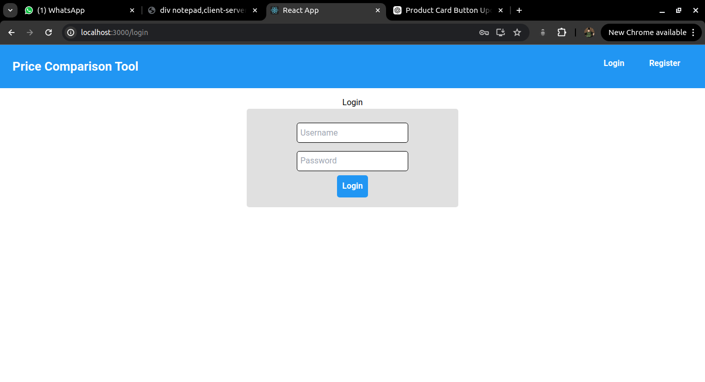

# Mobile Price Comparison Tool

A full-stack web application that allows users to compare prices of mobile phones e-commerce websites Amazon and Flipkart, track price changes, and receive email notifications when prices drop.
**Backend Repository**: [price-comparison-backend](https://github.com/JeevanRaj22/price_comparison_backend.git)

## Table of Contents
- [Features](#features)
- [Tech Stack](#tech-stack)
- [Screenshots](#screenshots)

## Features
- Real-time price comparison between Amazon and Flipkart.
- Wishlist for saving favorite products.
- Automated email notifications for price changes.
- Daily price update using Celery and Redis.

## Tech Stack
- **Frontend**: React, HTML, CSS, JavaScript
- **Backend**: Django, Selenium, Celery, Redis
- **Database**: PostgreSQL
- **Web Scraping**: Scrapy, Selenium

## Screenshots
Registration Page:
The Register Page enables new users to create an account on the platform by providingnecessary information such as username, email, and password.

**Login Page:**
Upon successful login, users are directed to the main interface

**Home Page:**
The Home Page serves as the primary interface where users can searchfor productsandview comparative pricing and discount information from e-commerce platforms like Amazon and Flipkart. The page is equipped with a search bar where users can enter the desired mobile phone name.

It shows real-time product data from Amazon and Flipkart, including prices, RAM, ROM,color.

Additionally, the Home Page includes a table that displays other relevant productsfoundon these platforms, giving users the option to directly view items on AmazonorFlipkartthrough provided links.

**Product Details Page:**
The Product Details page displays detailed information about a specific product, fetchedinreal-time from Amazon and Flipkart. When a user navigates to this page, it retrieves the latest product details, including its specifications, offers, and technical details.

**Wishlist Page:**
The Wishlist page is designed to display all the products that a user has saved to their wishlist. It fetches the user's wishlist from the server upon loading and displays each product using the WishlistCard component. The page also provides an option to remove items from the wishlist.

